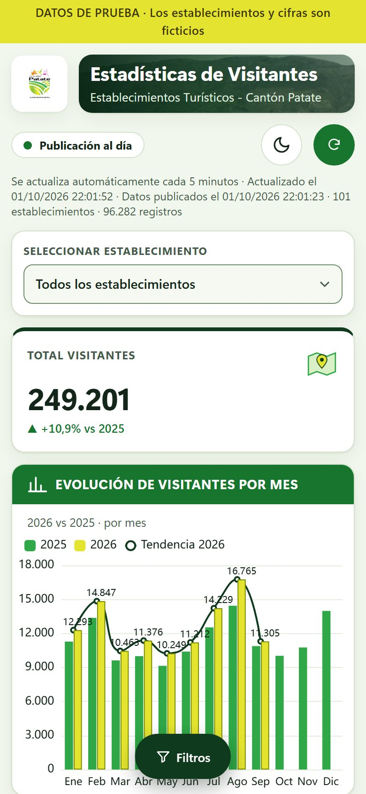
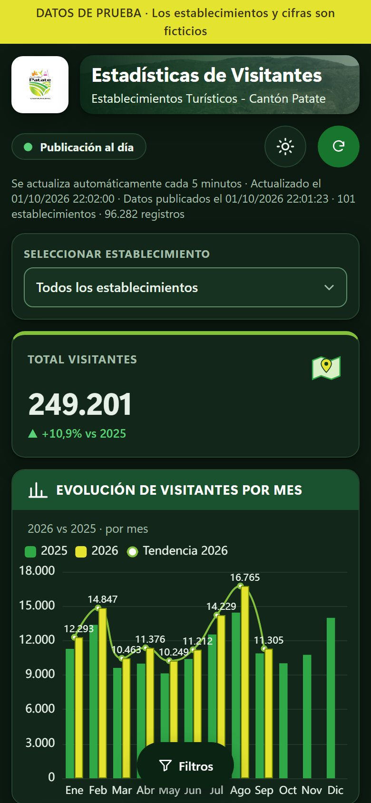
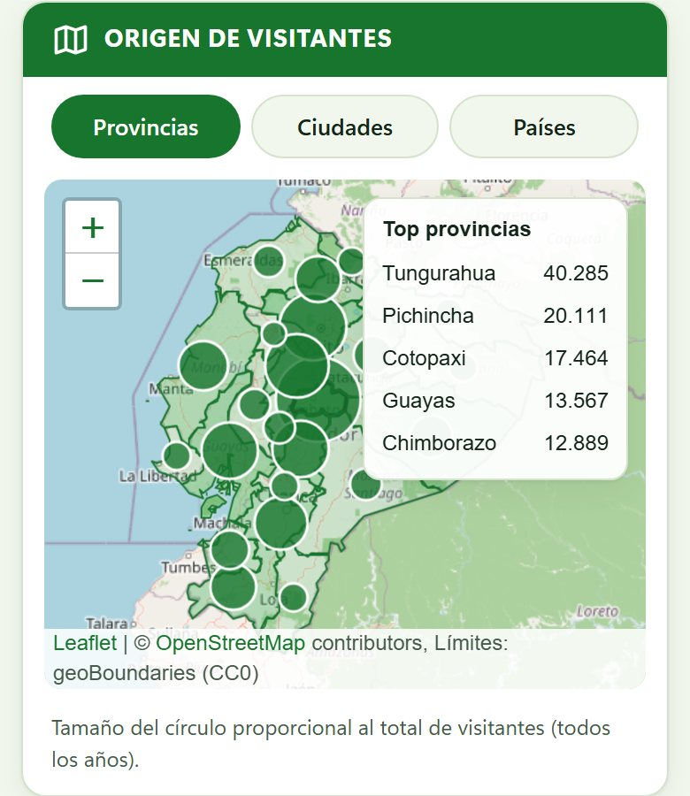
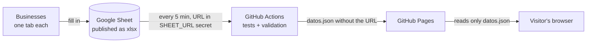

# Visitor Statistics · Patate Canton

[](https://github.com/Alexis-VsCode/turismo-patate/actions/workflows/publicar.yml)
[](https://alexis-vscode.github.io/turismo-patate/)


> [Versión en español](README.md)

Public dashboard for the **Municipal Government of San Cristóbal de Patate (Ecuador)** showing visitor
statistics for the canton's tourism businesses. Each business fills in a shared spreadsheet and the dashboard
refreshes itself, with no servers of its own and no paid licenses.

**[Live demo](https://alexis-vscode.github.io/turismo-patate/)** (the interface is in Spanish) ·
[Documentation](docs/README.md) · [Operations manual](docs/operacion.md) (Spanish)

## Preview

| Light mode | Dark mode |
|---|---|
| [](docs/capturas/escritorio.jpg) | [](docs/capturas/escritorio-oscuro.jpg) |

| Phone, light | Phone, dark | Phone, map |
|---|---|---|
| <a href="docs/capturas/celular.jpg"></a> | <a href="docs/capturas/celular-oscuro.jpg"></a> | <a href="docs/capturas/celular-mapa.jpg"></a> |

## The problem

The municipality needed to publish how many people visit its restaurants, inns and attractions, where they
come from, why they come, and their age and gender. The requirements were:
- **Simple data entry:** each business records its visitors in its own tab of a Google Sheet, using
  dropdowns.
- **Automatic onboarding:** a new tab automatically becomes a new business, with no code changes.
- **Public and free:** the dashboard is linked from the municipal website, works on phones and needs no
  Power BI Pro license.
- **Secure:** the spreadsheet is never exposed; the site publishes only aggregated, validated data.

## Features

- **Indicators:** total visitors with the **change against the same period of the previous year** (▲ or ▼).
  Figures animate when filtering.
- **Nationals vs foreigners:** a donut chart with the total in the center, the figures and percentages of each
  group, and a sentence that is worded according to the filters ("… during 2025", "… in March 2025").
- **Charts:**
  - monthly evolution comparing two years, with a trend line;
  - visit reasons with an icon, a bar, a figure and a percentage;
  - distribution by age (0-30, 31-45, 46-60 and 61+) with **Total women** and **Total men**, their figures and percentages;
  - **people with disabilities**: the total, its share of visitors and how many monthly records fall in each range
    (1-5, 6-10, 11-15). It is published only as an aggregate figure and is not crossed with age or gender.
- **Real map** (OpenStreetMap + Leaflet) with three tabs: **Provinces**, **Cities** and **Countries**. Each tab
  changes the bubbles, the "Top" list and the framing, and stays in sync with the Country / City filter.
- **Filters:**
  - **several options at once** for business, country / city / province, reason, age and gender, with type-ahead search
    (over 450 grouped origin options); year and month stay single-choice;
  - options inside one filter are added together and different filters are intersected;
  - **cross-filtering** by clicking the charts, the reasons list and the map;
  - **active-filter tags** above the charts, removed one by one or all at once, which filter the whole dashboard.
- **Refresh and freshness:** on load, with the "Actualizar" button and automatically **every 5 minutes**. The
  site shows when it was refreshed in this browser and when the data was published, and a chip tells whether
  publishing is up to date, delayed or stopped.
- **Data quality:** invalid rows are never dropped silently; they are listed with their tab and row.
- **Responsive design:** on phones it is a single column, with a floating "Filtros" button that opens a bottom
  sheet; no horizontal scrolling.
- **Light and dark mode:** a button switches the theme; with no saved choice it follows the device.

## How it works



The spreadsheet URL **never** reaches the code or the site: it lives as an encrypted GitHub secret and only the
scheduled job uses it. Details in [docs/configuracion.md](docs/configuracion.md) (Spanish).

## About the project

This dashboard started from a concrete need of the Municipal Government of Patate: tourism businesses were
already recording their visitors, but that data reached nobody. I set out to publish it without licenses or
servers, and so that anyone at the municipality could add a business just by duplicating a tab.

The decisions that taught me the most:
- **Hiding the source without a backend.** The spreadsheet URL lives as a GitHub Actions secret and the site
  only publishes data that has already been validated.
- **Measuring instead of assuming.** Every figure on the dashboard is reconciled against an independent
  calculation in Python, so a formula error never reaches production.
- **Making the dashboard tell the truth about its own data.** If automatic publishing stops, the site does not
  keep saying "live": a chip says so.
- **Designing for phones first.** Most visits to the municipal website come from a phone.

The alternatives I discarded, and why, are in the [design decisions](docs/decisiones/) (Spanish).

## Observability

**Basic** observability, sized for a static site:
- **Data freshness:** the age of the publication is computed by a pure function and shown in a chip with text
  and color ("Publicación al día", "retrasada" or "detenida", that is, up to date, delayed or stopped).
- **Every publication leaves a trace:** the data builder writes a JSON log line and a summary in the
  **Actions** tab, with counts and durations, never tab names.
- **Stated limit:** the chip is seen by visitors; alerting whoever operates the site depends on GitHub's
  notifications for a failed workflow.

Details, thresholds and what to do when the chip is not green: [docs/observabilidad.md](docs/observabilidad.md)
(Spanish).

## Stack

| Layer | Technology |
|---|---|
| Interface | HTML, CSS and JavaScript (ES modules), no framework and no build step |
| Charts | Apache ECharts 6.1.0 |
| Map | Leaflet 1.9.4 + OpenStreetMap tiles + geoBoundaries province limits (CC0); geoBoundaries canton catalog (CC BY 3.0 IGO) and mledoze/countries (ODbL) |
| Excel reading | SheetJS 0.20.3, only inside GitHub Actions |
| Publishing | GitHub Actions (every 5 min) + GitHub Pages |
| Testing | `node:test` (Node 22) and an independent Python/openpyxl oracle |

## Architecture

The code follows a **semi-hexagonal architecture**. A test enforces that no layer depends on one it should not.

| Layer | Folder | Responsibility |
|---|---|---|
| Domain | [`src/domain/`](src/domain) | Pure rules: visitor normalization, catalog, statistics and freshness |
| Infrastructure | [`src/infrastructure/`](src/infrastructure) | Configuration, bounded download, `datos.json` contract and Excel reading |
| Facade | [`src/application/tablero.facade.js`](src/application/tablero.facade.js) | State, filters, refresh policy and computed view, no DOM |
| Container | [`src/application/components/tablero.container.js`](src/application/components/tablero.container.js) | Connects the page to the facade |
| Presentational | [`src/application/components/presentational/`](src/application/components/presentational) | Charts, map, reasons, cards and notices, stateless |
| Shared | [`src/shared/`](src/shared) | Texts, formatting and theme logic |
| Composition root | [`src/main.js`](src/main.js) | Wires infrastructure, facade and container, and traces the whole flow |

More in [docs/arquitectura.md](docs/arquitectura.md) and in the [design decisions](docs/decisiones/) (Spanish).

## Security

- **Libraries:** pinned versions with no known CVEs at review time. ECharts 6.1.0 fixes CVE-2026-45249 and
  SheetJS 0.20.3 fixes CVE-2023-30533 and CVE-2024-22363.
- **Integrity (SRI):** every external script carries its `integrity` hash.
- **CSP:** a strict policy with `connect-src 'self'`, no inline scripts and no `eval`.
- **Spreadsheet content:** treated as untrusted input. It is written with `textContent` or the DOM API,
  protected against prototype pollution, and the download is bounded in size and time.
- **Privacy:** no cookies and no tracking. The only thing stored on the device is the theme choice, and it is
  never sent anywhere.

Details in [docs/seguridad.md](docs/seguridad.md) (Spanish). To report a vulnerability, see
[SECURITY.md](SECURITY.md).

## Tests

They run on every publication, and a publication with a red test does not ship:

| Folder | What it tests |
|---|---|
| [`test/domain/`](test/domain) | The filter scenarios (totals, series and year-over-year change) reconcile **exactly** with an independent Python oracle ([`tools/oraculo.py`](tools/oraculo.py)) over the real workbook. Also data freshness |
| [`test/infrastructure/`](test/infrastructure) | Normalization of real-world typos (`agosoto`, spaces, accents), rejected rows with their location, the `datos.json` contract, hostile HTML, `__proto__` and bounded download |
| [`test/application/`](test/application) | Facade with a simulated clock (reuse, automatic refresh, data kept on errors, map tabs, period texts) and the chart options |
| [`test/shared/`](test/shared) | Number and date formatting, filter-dependent texts and the theme, including the script that prevents flicker |
| [`test/arquitectura.test.mjs`](test/arquitectura.test.mjs) | Dependency rule between layers |
| [`test/tema-tokens.test.mjs`](test/tema-tokens.test.mjs) | Every color token in use exists, so no chart falls back to a default palette |

## Run locally

Requirements: Node 22 or later, and Python 3 with `openpyxl` (only for the oracle and the test-data generator).

```bash
npm test
```

```bash
npm run datos
```

```bash
npm run servir
```

Then open `http://127.0.0.1:8765/`. `npm run datos` generates `datos/datos.json` from the test workbook in
[`test/fixtures/`](test/fixtures), and `npm run servir` starts a cache-free server so old modules are never mixed
with new styles. Since automatic publishing does not run locally, the freshness chip turns to
"Publicación detenida" (publishing stopped) some time after the data was generated; regenerate it with
`npm run datos`.

## Structure

```
├── index.html · css/tema.css
├── src/            domain · infrastructure · application · shared · main.js
├── assets/         logo, header photo and province limits
├── tools/          data builder, oracle, test-data generator, local server, vendor
├── test/           tests per layer and fixtures
├── docs/           architecture, configuration, operations, observability, security, decisions and screenshots
└── .github/workflows/publicar.yml
```

## Documentation

The documents in `docs/` are written in Spanish, the language of the project's users.

- [Architecture](docs/arquitectura.md)
- [Configuration](docs/configuracion.md)
- [Operations manual](docs/operacion.md)
- [Observability](docs/observabilidad.md)
- [Security](docs/seguridad.md) and [security policy](SECURITY.md)
- [Design decisions (ADR)](docs/decisiones/)
- [Contributing guide](CONTRIBUTING.md)
- [Changelog](CHANGELOG.md)

## Author

**Ing. Kevin Alexis Barrera Llerena**, Software Engineer. Design, architecture and development.

[](https://www.linkedin.com/in/alexisbarreradesarrolador/)
[](https://www.facebook.com/alexis.barrerallerena1804)
[](https://www.tiktok.com/@mancogamesam)

## License

© 2026 Kevin Alexis Barrera Llerena. **All rights reserved.** The code is published for reference and
portfolio purposes; reuse requires the author's written permission (see [LICENSE](LICENSE)). Third-party
components keep their own licenses ([THIRD_PARTY_NOTICES.md](THIRD_PARTY_NOTICES.md)).

The pilot data is **fictitious**, generated by [`tools/generar-piloto.py`](tools/generar-piloto.py).
