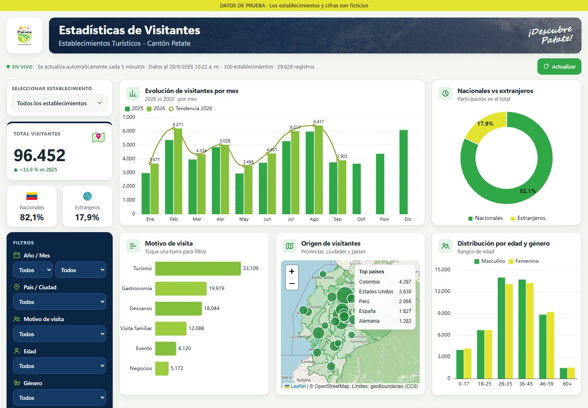
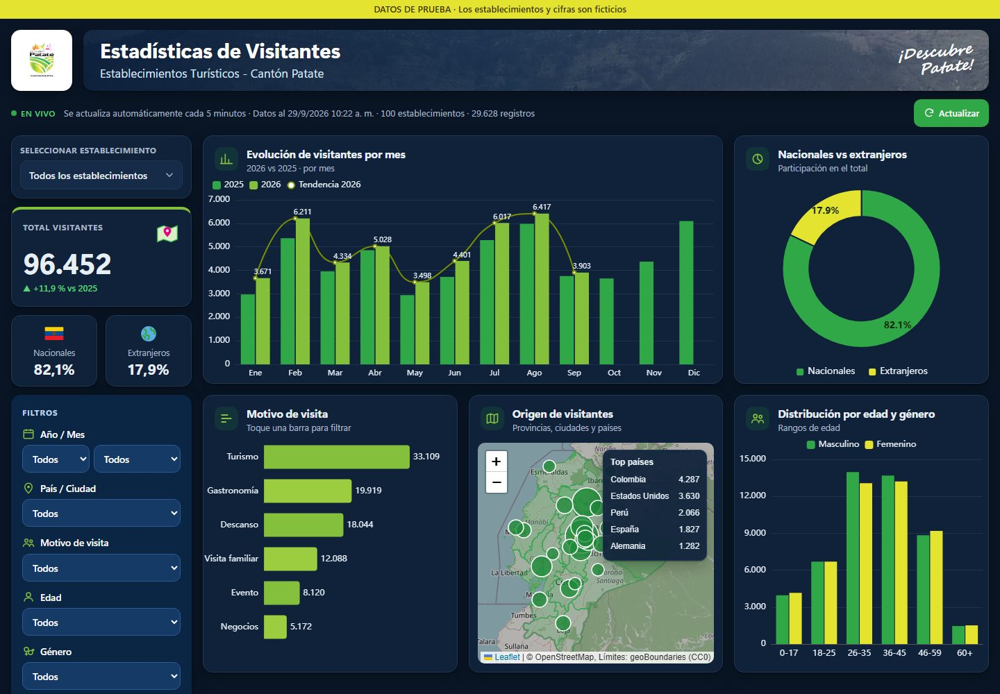
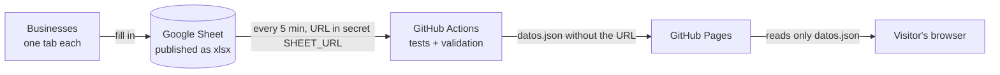

# Visitor Statistics · Patate Canton

[](https://github.com/Alexis-VsCode/turismo-patate/actions/workflows/publicar.yml)
[](https://alexis-vscode.github.io/turismo-patate/)


> [Versión en español](README.md)

Public dashboard for the **Municipal Government of San Cristóbal de Patate (Ecuador)** showing visitor
statistics for the canton's tourism businesses. Each business fills in a shared spreadsheet and the dashboard
refreshes itself, with no servers of its own and no paid licenses.

**Live demo:** https://alexis-vscode.github.io/turismo-patate/ (the interface is in Spanish).

| Light mode | Dark mode |
|---|---|
|  |  |

## The problem

The municipality needed to publish how many people visit its restaurants, inns and attractions, where they
come from, why they come, and their age and gender. The requirements were:
- **Simple data entry:** each business records its visitors in its own tab of a Google Sheet, using
  dropdowns.
- **Automatic onboarding:** a new tab automatically becomes a new business, with no code changes.
- **Public and free:** the dashboard is linked from the municipal website, works on phones and needs no
  Power BI Pro license.
- **Secure:** the spreadsheet is never exposed; the site publishes only aggregated, validated data.

## Features

- **KPIs:** total visitors with **year-over-year change** for the same period, and share of domestic and
  foreign visitors. Figures animate when filters change.
- **Charts:**
  - monthly trend comparing two years, with a trend line;
  - domestic vs. foreign donut;
  - visit reasons;
  - age and gender distribution.
- **Real map** (OpenStreetMap + Leaflet):
  - Ecuadorian provinces shaded by visitors, with Tungurahua highlighted;
  - bubbles by city of origin and a top-countries list;
  - automatic zoom driven by the Country / City filter.
- **Filters:**
  - searchable business picker, built for hundreds of options;
  - year, month, origin, reason, age and gender;
  - **cross-filtering** by clicking charts and the map;
  - **active-filter chips**, removable with one tap.
- **Refresh:** on page load, with the «Actualizar» button, and automatically **every 5 minutes**, with the
  data timestamp always visible.
- **Data quality:** invalid rows are never dropped silently; each one is listed with its tab and row.
- **Responsive:** single column on phones, with a floating «Filtros» button that opens a bottom sheet; no
  horizontal scrolling.
- **Automatic dark mode:** follows the device theme.

## How it works



The spreadsheet URL **never** reaches the code or the site. It lives in an encrypted GitHub secret and only
the scheduled job uses it. Details (in Spanish) in [docs/configuracion.md](docs/configuracion.md).

## Tech stack

| Layer | Technology |
|---|---|
| UI | HTML, CSS and vanilla JavaScript (ES modules), no framework and no build step |
| Charts | Apache ECharts 6.1.0 |
| Map | Leaflet 1.9.4 + OpenStreetMap tiles + geoBoundaries borders (CC0) |
| Excel parsing | SheetJS 0.20.3, inside GitHub Actions only |
| Delivery | GitHub Actions (every 5 min) + GitHub Pages |
| Testing | `node:test` (Node 22 in CI) and an independent Python/openpyxl oracle |

## Architecture

The code follows a **semi-hexagonal architecture**. An automated test enforces the dependency rule between
layers.

| Layer | Folder | Responsibility |
|---|---|---|
| Domain | [`src/domain/`](src/domain) | Pure rules: visitor normalization, catalog and statistics |
| Infrastructure | [`src/infrastructure/`](src/infrastructure) | Config, bounded download, `datos.json` contract, Excel reader |
| Facade | [`src/application/tablero.facade.js`](src/application/tablero.facade.js) | State, filters and refresh policy, no DOM |
| Container | [`src/application/components/tablero.container.js`](src/application/components/tablero.container.js) | Wires the page to the facade |
| Presentational | [`src/application/components/presentational/`](src/application/components/presentational) | Stateless charts, map, KPI cards and notices |
| Composition root | [`src/main.js`](src/main.js) | Assembles infrastructure, facade and container |

## Security

- **Libraries:** pinned versions with no known CVEs as of the review date. ECharts 6.1.0 fixes
  CVE-2026-45249, and SheetJS 0.20.3 fixes CVE-2023-30533 and CVE-2024-22363.
- **Integrity (SRI):** every external script carries its `integrity` hash.
- **CSP:** a strict policy with `connect-src 'self'`, no inline scripts and no `eval`.
- **Spreadsheet content:** treated as untrusted input. It is rendered only through `textContent`, guarded
  against prototype pollution, and downloads are bounded in size and time.

See [SECURITY.md](SECURITY.md) to report a vulnerability.

## Tests

64 automated tests run on every deployment:
- **Filter scenarios:** 7 scenarios reconcile **exactly** with an independent Python oracle over the real
  workbook.
- **Data contract:** round-trip of `datos.json`, plus rejection of a tampered file.
- **Security:** hostile HTML, prototype pollution and bounded downloads.
- **Refresh policy:** tested with a simulated clock.
- **Architecture:** the layer dependency guard.

## About the project

This dashboard started from a real need at the Patate municipality: local businesses were already recording
their visitors, but the data never reached anyone. My goal was to publish it with no licenses and no servers,
and to let anyone at the municipality add a business just by duplicating a spreadsheet tab. The key lessons: hiding
the data source without a backend, reconciling every figure against an independent calculation, and designing
for phones first.

## Run locally

```bash
npm test
```

```bash
npm run datos
```

```bash
python -m http.server 8765 --bind 127.0.0.1
```

## Author

**Kevin Alexis Barrera Llerena**, Software Engineer. Design, architecture and development.

[](https://www.linkedin.com/in/alexisbarreradesarrolador/)
[](https://www.facebook.com/alexis.barrerallerena1804)

## License

© 2026 Kevin Alexis Barrera Llerena. **All rights reserved.** The source is published for reference and
portfolio purposes; reuse requires the author's written permission (see [LICENSE](LICENSE)). Third-party
components keep their own licenses ([THIRD_PARTY_NOTICES.md](THIRD_PARTY_NOTICES.md)). Pilot data is
**fictitious**.
