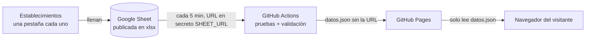

# Estadísticas de Visitantes · Cantón Patate

[](https://github.com/Alexis-VsCode/turismo-patate/actions/workflows/publicar.yml)
[](https://alexis-vscode.github.io/turismo-patate/)


> [English version](README.en.md)

Dashboard público del **GAD Municipal de San Cristóbal de Patate (Ecuador)** con las estadísticas de visitantes
de los establecimientos turísticos del cantón. Los establecimientos llenan una hoja de cálculo compartida y el
tablero se actualiza solo, sin servidores propios ni licencias.

**[Ver demo en vivo](https://alexis-vscode.github.io/turismo-patate/)** · [Documentación](docs/README.md) ·
[Manual de operación](docs/operacion.md)

## Vista previa

| Modo claro | Modo oscuro |
|---|---|
| [](docs/capturas/escritorio.jpg) | [](docs/capturas/escritorio-oscuro.jpg) |

| Celular, claro | Celular, oscuro | Celular, mapa |
|---|---|---|
| <a href="docs/capturas/celular.jpg"></a> | <a href="docs/capturas/celular-oscuro.jpg"></a> | <a href="docs/capturas/celular-mapa.jpg"></a> |

## El problema que resuelve

El municipio necesitaba publicar cuántas personas visitan sus restaurantes, hosterías y atractivos, de dónde
vienen, por qué motivo, y con qué edad y género. Las condiciones eran:
- **Captura simple:** cada establecimiento anota sus visitantes en su propia pestaña de una Google Sheet, con
  desplegables.
- **Alta automática:** una pestaña nueva se convierte en un establecimiento nuevo sin tocar código.
- **Público y gratuito:** el tablero se enlaza desde la web del municipio, abre en el celular y no depende de
  licencias como Power BI Pro.
- **Seguro:** la hoja no se expone. El sitio solo publica datos agregados y validados.

## Funcionalidades

- **Indicadores:** total de visitantes con su **variación contra el mismo período del año anterior**
  (▲ o ▼). Las cifras se animan al filtrar.
- **Participación de nacionales y extranjeros:** una dona con el total al centro, las cifras y porcentajes de
  cada grupo, y una frase que se redacta según los filtros («… durante el 2025», «… en marzo de 2025»).
- **Gráficos:**
  - evolución mensual comparando dos años, con línea de tendencia;
  - motivos de visita con ícono, barra, cifra y porcentaje;
  - distribución por edad (0-30, 31-45, 46-60 y 61+) con **Total mujeres** y **Total hombres**, sus cifras y porcentajes;
  - **personas con discapacidad**: la cifra, su porcentaje sobre los visitantes y cuántos registros mensuales caen en cada
    rango (1-5, 6-10, 11-15). Se publica solo como cifra agregada y no se cruza con la edad ni con el género.
- **Mapa real** (OpenStreetMap + Leaflet) con tres pestañas: **Provincias**, **Ciudades** y **Países**. Cada
  pestaña cambia las burbujas, el «Top» y el encuadre, y se sincroniza con el filtro País / Ciudad.
- **Filtros:**
  - **varias opciones a la vez** en establecimiento, país / ciudad / provincia, motivo, edad y género, con búsqueda al escribir
    (más de 450 opciones de procedencia, agrupadas); año y mes son de una sola opción;
  - dentro de un filtro las opciones se suman y entre filtros se cruzan;
  - **filtrado cruzado** con clic en los gráficos, en la lista de motivos y en el mapa;
  - **etiquetas de filtros activos** sobre los gráficos, que se quitan una por una o todas a la vez, y que filtran todo el tablero.
- **Actualización y frescura:** al entrar, con el botón «Actualizar» y de forma automática **cada 5 minutos**. El
  sitio muestra cuándo se actualizó en este navegador y cuándo se publicaron los datos, y un chip indica si la
  publicación está al día, retrasada o detenida.
- **Calidad de datos:** las filas inválidas no se descartan en silencio; se listan con su pestaña y su fila.
- **Diseño adaptable:** en el celular se ve en una columna, con un botón flotante «Filtros» que abre un panel
  desde abajo; sin scroll horizontal.
- **Modo claro y oscuro:** un botón cambia el tema; sin elección guardada, sigue el del dispositivo.

## Cómo funciona



La URL de la hoja **nunca** llega al código ni al sitio: vive como secreto cifrado de GitHub, y solo la usa la
tarea automática. Detalle en [docs/configuracion.md](docs/configuracion.md).

## Sobre el proyecto

Este tablero nació de una necesidad concreta del GAD Municipal de Patate: los establecimientos turísticos ya
anotaban a sus visitantes, pero esos datos no llegaban a nadie. Me propuse que publicarlos no costara licencias
ni servidores, y que cualquier persona del municipio pudiera sumar un establecimiento con solo duplicar una
pestaña.

Las decisiones que más me enseñaron:
- **Ocultar la fuente sin un backend.** La URL de la hoja vive como secreto de GitHub Actions y el sitio solo
  publica datos ya validados.
- **Medir en lugar de suponer.** Cada cifra del tablero se concilia contra un cálculo independiente en Python,
  así un error de fórmula no llega a producción.
- **Que el tablero diga la verdad sobre sus propios datos.** Si la publicación automática se detiene, el sitio no
  sigue diciendo «en vivo»: un chip lo indica.
- **Diseñar para el celular primero.** La mayoría de visitas a la web municipal llega desde el teléfono.

Las alternativas que descarté, y por qué, están en las [decisiones de diseño](docs/decisiones/).

## Observabilidad

Observabilidad **básica**, pensada para un sitio estático:
- **Frescura de los datos:** la edad de la publicación se calcula con una función pura y se muestra en un chip
  con texto y color («Publicación al día», «retrasada» o «detenida»).
- **Cada publicación deja rastro:** el constructor de datos escribe una línea de log JSON y un resumen en la
  pestaña **Actions**, con cuentas y duraciones, nunca nombres de pestañas.
- **Límite declarado:** el chip lo ven los visitantes; avisar a quien opera depende de las notificaciones de
  GitHub por un workflow fallido.

Detalle, umbrales y qué hacer cuando el chip no está en verde: [docs/observabilidad.md](docs/observabilidad.md).

## Stack

| Capa | Tecnología |
|---|---|
| Interfaz | HTML, CSS y JavaScript (módulos ES), sin framework ni paso de build |
| Gráficos | Apache ECharts 6.1.0 |
| Mapa | Leaflet 1.9.4 + teselas OpenStreetMap + límites provinciales geoBoundaries (CC0); catálogo de cantones geoBoundaries (CC BY 3.0 IGO) y de países mledoze/countries (ODbL) |
| Lectura del Excel | SheetJS 0.20.3, solo dentro de GitHub Actions |
| Publicación | GitHub Actions (cada 5 min) + GitHub Pages |
| Pruebas | `node:test` (Node 22) y oráculo independiente en Python/openpyxl |

## Arquitectura

El código sigue una **arquitectura semihexagonal**. Una prueba vigila que ninguna capa dependa de otra que no le
corresponde.

| Capa | Carpeta | Responsabilidad |
|---|---|---|
| Dominio | [`src/domain/`](src/domain) | Reglas puras: normalización de visitantes, catálogo, estadísticas y frescura |
| Infraestructura | [`src/infrastructure/`](src/infrastructure) | Configuración, descarga acotada, contrato de `datos.json` y lectura del Excel |
| Fachada | [`src/application/tablero.facade.js`](src/application/tablero.facade.js) | Estado, filtros, política de actualización y vista calculada, sin DOM |
| Container | [`src/application/components/tablero.container.js`](src/application/components/tablero.container.js) | Conecta la página con la fachada |
| Presentacionales | [`src/application/components/presentational/`](src/application/components/presentational) | Gráficos, mapa, motivos, tarjetas y avisos, sin estado |
| Shared | [`src/shared/`](src/shared) | Textos, formato y lógica del tema |
| Raíz de composición | [`src/main.js`](src/main.js) | Une infraestructura, fachada y container, y traza el flujo completo |

Más en [docs/arquitectura.md](docs/arquitectura.md) y en las [decisiones de diseño](docs/decisiones/).

## Seguridad

- **Librerías:** versiones fijas y sin CVE conocidos a la fecha de revisión. ECharts 6.1.0 corrige
  CVE-2026-45249 y SheetJS 0.20.3 corrige CVE-2023-30533 y CVE-2024-22363.
- **Integridad (SRI):** cada script externo lleva su hash `integrity`.
- **CSP:** una política estricta con `connect-src 'self'`, sin scripts en línea ni `eval`.
- **Contenido de la hoja:** se trata como entrada no confiable. Se escribe con `textContent` o con la API del
  DOM, se protege contra la contaminación de prototipos y la descarga tiene límites de tamaño y tiempo.
- **Privacidad:** sin cookies ni rastreo. Solo se guarda en el dispositivo la elección de tema, y no se envía a
  ningún sitio.

Detalle en [docs/seguridad.md](docs/seguridad.md). Para reportar una vulnerabilidad, ver [SECURITY.md](SECURITY.md).

## Pruebas

Corren en cada publicación, y una publicación con una prueba en rojo no sale:

| Carpeta | Qué prueba |
|---|---|
| [`test/domain/`](test/domain) | Los escenarios de filtros (totales, series y variación interanual) concilian **exactamente** con un oráculo independiente en Python ([`tools/oraculo.py`](tools/oraculo.py)) sobre el libro real. También la frescura de los datos |
| [`test/infrastructure/`](test/infrastructure) | Normalización de errores reales (`agosoto`, espacios, tildes), filas rechazadas con ubicación, contrato de `datos.json`, HTML hostil, `__proto__` y descarga acotada |
| [`test/application/`](test/application) | Fachada con reloj simulado (reuso, actualización automática, datos conservados ante errores, pestañas del mapa, textos del periodo) y las opciones de los gráficos |
| [`test/shared/`](test/shared) | Formato de números y fechas, textos que dependen de los filtros y el tema, incluido el script que evita el parpadeo |
| [`test/arquitectura.test.mjs`](test/arquitectura.test.mjs) | Regla de dependencias entre capas |
| [`test/tema-tokens.test.mjs`](test/tema-tokens.test.mjs) | Todo token de color usado existe, para que ningún gráfico caiga en una paleta por defecto |

## Ejecutar en local

Requisitos: Node 22 o superior y Python 3 con `openpyxl` (solo para el oráculo y el generador de datos de prueba).

```bash
npm test
```

```bash
npm run datos
```

```bash
npm run servir
```

Luego se abre `http://127.0.0.1:8765/`. `npm run datos` genera `datos/datos.json` a partir del libro de prueba de
[`test/fixtures/`](test/fixtures), y `npm run servir` levanta un servidor sin caché, para no mezclar módulos
viejos con estilos nuevos. Como en local no corre la publicación automática, el chip de frescura pasa a
«Publicación detenida» a la hora de haber generado los datos; se vuelve a generar con `npm run datos`.

## Estructura

```
├── index.html · css/tema.css
├── src/            domain · infrastructure · application · shared · main.js
├── assets/         logo, foto de cabecera y límites provinciales
├── tools/          constructor de datos, oráculo, generador de datos de prueba, servidor local, vendor
├── test/           pruebas por capa y fixtures
├── docs/           arquitectura, configuración, operación, observabilidad, seguridad, decisiones y capturas
└── .github/workflows/publicar.yml
```

## Documentación

- [Arquitectura](docs/arquitectura.md)
- [Configuración: dónde se configura cada cosa y cómo se oculta la URL de la hoja](docs/configuracion.md)
- [Manual de operación](docs/operacion.md)
- [Observabilidad](docs/observabilidad.md)
- [Seguridad](docs/seguridad.md) y [política de seguridad](SECURITY.md)
- [Decisiones de diseño (ADR)](docs/decisiones/)
- [Guía de contribución](CONTRIBUTING.md)
- [Registro de cambios](CHANGELOG.md)

## Autor

**Ing. Kevin Alexis Barrera Llerena**, Ingeniero de Software. Diseño, arquitectura y desarrollo.

[](https://www.linkedin.com/in/alexisbarreradesarrolador/)
[](https://www.facebook.com/alexis.barrerallerena1804)
[](https://www.tiktok.com/@mancogamesam)

## Licencia

© 2026 Kevin Alexis Barrera Llerena. **Todos los derechos reservados.** El código se publica para consulta y
portafolio; su reutilización requiere autorización escrita del autor (ver [LICENSE](LICENSE)). Los componentes
de terceros conservan sus licencias ([THIRD_PARTY_NOTICES.md](THIRD_PARTY_NOTICES.md)).

Los datos del piloto son **ficticios**, generados por [`tools/generar-piloto.py`](tools/generar-piloto.py).
