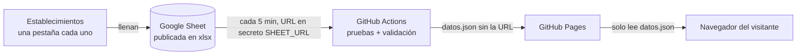

# Estadísticas de Visitantes · Cantón Patate

[](https://github.com/Alexis-VsCode/turismo-patate/actions/workflows/publicar.yml)
[](https://alexis-vscode.github.io/turismo-patate/)


> [English version](README.en.md)

Dashboard público del **GAD Municipal de San Cristóbal de Patate (Ecuador)** con las estadísticas de visitantes
de los establecimientos turísticos del cantón. Los establecimientos llenan una hoja de cálculo compartida y el
tablero se actualiza solo, sin servidores propios ni licencias.

**Demo en vivo:** https://alexis-vscode.github.io/turismo-patate/

| Modo claro | Modo oscuro |
|---|---|
|  |  |

## El problema que resuelve

El municipio necesitaba publicar cuántas personas visitan sus restaurantes, hosterías y atractivos, de dónde
vienen, por qué motivo, y con qué edad y género. Las condiciones eran:
- **Captura simple:** cada establecimiento anota sus visitantes en su propia pestaña de una Google Sheet, con
  desplegables.
- **Alta automática:** una pestaña nueva se convierte en un establecimiento nuevo sin tocar código.
- **Público y gratuito:** el tablero se enlaza desde la web del municipio, abre en el celular y no depende de
  licencias como Power BI Pro.
- **Seguro:** la hoja no se expone. El sitio solo publica datos agregados y validados.

## Funcionalidades

- **Indicadores:** total de visitantes con su **variación contra el mismo período del año anterior**
  (▲ o ▼), y porcentaje de nacionales y de extranjeros. Las cifras se animan al filtrar.
- **Gráficos:**
  - evolución mensual comparando dos años, con línea de tendencia;
  - dona de nacionales frente a extranjeros;
  - barras por motivo de visita;
  - distribución por edad y género.
- **Mapa real** (OpenStreetMap + Leaflet):
  - provincias de Ecuador coloreadas por visitantes, con Tungurahua resaltada;
  - burbujas por ciudad de origen y un Top de países;
  - zoom automático según el filtro País / Ciudad.
- **Filtros:**
  - combo de establecimiento con búsqueda al escribir, pensado para cientos de opciones;
  - año, mes, procedencia, motivo, edad y género;
  - **filtrado cruzado** con clic en los gráficos y en el mapa;
  - **chips de filtros activos**, que se quitan con un toque.
- **Actualización:** al entrar, con el botón «Actualizar» y de forma automática **cada 5 minutos**, con la
  hora de los datos siempre visible.
- **Calidad de datos:** las filas inválidas no se descartan en silencio; se listan con su pestaña y su fila.
- **Diseño adaptable:** en el celular se ve en una columna, con un botón flotante «Filtros» que abre un panel
  desde abajo; sin scroll horizontal.
- **Modo oscuro automático:** sigue el tema del dispositivo.

## Cómo funciona



La URL de la hoja **nunca** llega al código ni al sitio: vive como secreto cifrado de GitHub, y solo la usa la
tarea automática. Detalle en [docs/configuracion.md](docs/configuracion.md).

## Stack

| Capa | Tecnología |
|---|---|
| Interfaz | HTML, CSS y JavaScript (módulos ES), sin framework ni paso de build |
| Gráficos | Apache ECharts 6.1.0 |
| Mapa | Leaflet 1.9.4 + teselas OpenStreetMap + límites geoBoundaries (CC0) |
| Lectura del Excel | SheetJS 0.20.3, solo dentro de GitHub Actions |
| Publicación | GitHub Actions (cada 5 min) + GitHub Pages |
| Pruebas | `node:test` (Node 22 en CI) y oráculo independiente en Python/openpyxl |

## Arquitectura

El código sigue una **arquitectura semihexagonal**. Una prueba vigila que ninguna capa dependa de otra que no le
corresponde.

| Capa | Carpeta | Responsabilidad |
|---|---|---|
| Dominio | [`src/domain/`](src/domain) | Reglas puras: normalización de visitantes, catálogo y estadísticas |
| Infraestructura | [`src/infrastructure/`](src/infrastructure) | Configuración, descarga acotada, contrato de `datos.json` y lectura del Excel |
| Fachada | [`src/application/tablero.facade.js`](src/application/tablero.facade.js) | Estado, filtros y política de actualización, sin DOM |
| Container | [`src/application/components/tablero.container.js`](src/application/components/tablero.container.js) | Conecta la página con la fachada |
| Presentacionales | [`src/application/components/presentational/`](src/application/components/presentational) | Gráficos, mapa, tarjetas y avisos, sin estado |
| Raíz de composición | [`src/main.js`](src/main.js) | Une infraestructura, fachada y container |

Más en [docs/arquitectura.md](docs/arquitectura.md) y en las [decisiones de diseño](docs/decisiones/).

## Seguridad

- **Librerías:** versiones fijas y sin CVE conocidos a la fecha de revisión. ECharts 6.1.0 corrige
  CVE-2026-45249 y SheetJS 0.20.3 corrige CVE-2023-30533 y CVE-2024-22363.
- **Integridad (SRI):** cada script externo lleva su hash `integrity`.
- **CSP:** una política estricta con `connect-src 'self'`, sin scripts en línea ni `eval`.
- **Contenido de la hoja:** se trata como entrada no confiable. Se escribe solo con `textContent`, se protege
  contra la contaminación de prototipos y la descarga tiene límites de tamaño y tiempo.

Detalle en [docs/seguridad.md](docs/seguridad.md). Para reportar una vulnerabilidad, ver [SECURITY.md](SECURITY.md).

## Pruebas

Son 64 pruebas automáticas y corren en cada publicación:

| Archivo | Qué prueba |
|---|---|
| [`test/domain/`](test/domain) | Los 7 escenarios de filtros (totales, series y variación interanual) concilian **exactamente** con un oráculo independiente en Python ([`tools/oraculo.py`](tools/oraculo.py)) sobre el libro real |
| [`test/infrastructure/`](test/infrastructure) | Normalización de errores reales (`agosoto`, espacios, tildes), filas rechazadas con ubicación, contrato de `datos.json` (ida y vuelta y paquete alterado), HTML hostil, `__proto__` y descarga acotada |
| [`test/application/`](test/application) | Fachada con reloj simulado: reuso de 60 s, automático cada 5 minutos solo con la pestaña visible, conservación de datos ante errores |
| [`test/arquitectura.test.mjs`](test/arquitectura.test.mjs) | Regla de dependencias entre capas |

## Ejecutar en local

Requisitos: Node 20 o superior y Python 3 con `openpyxl` (solo para el oráculo y el generador de datos de prueba).

```bash
npm test
```

```bash
npm run datos
```

```bash
python -m http.server 8765 --bind 127.0.0.1
```

Luego se abre `http://127.0.0.1:8765/`. `npm run datos` genera `datos/datos.json` a partir del libro de prueba
de [`test/fixtures/`](test/fixtures).

## Estructura

```
├── index.html · css/tema.css
├── src/            domain · infrastructure · application · shared · main.js
├── assets/         logo, foto de cabecera y límites provinciales
├── tools/          constructor de datos, oráculo, generador de datos de prueba, vendor
├── test/           pruebas por capa y fixtures
├── docs/           arquitectura, configuración, operación, seguridad, decisiones y capturas
└── .github/workflows/publicar.yml
```

## Sobre el proyecto

Este tablero nació de una necesidad concreta del GAD Municipal de Patate: los establecimientos turísticos ya
anotaban a sus visitantes, pero esos datos no llegaban a nadie. Me propuse que publicarlos no costara licencias
ni servidores, y que cualquier persona del municipio pudiera sumar un establecimiento con solo duplicar una
pestaña.

Las decisiones que más me enseñaron:
- **Ocultar la fuente sin un backend.** La URL de la hoja vive como secreto de GitHub Actions y el sitio solo
  publica datos ya validados.
- **Medir en lugar de suponer.** Cada cifra del tablero se concilia contra un cálculo independiente en Python,
  así un error de fórmula no llega a producción.
- **Diseñar para el celular primero.** La mayoría de visitas a la web municipal llega desde el teléfono.

Las alternativas que descarté, y por qué, están en las [decisiones de diseño](docs/decisiones/).

## Documentación

- [Arquitectura](docs/arquitectura.md)
- [Configuración: dónde se configura cada cosa y cómo se oculta la URL de la hoja](docs/configuracion.md)
- [Manual de operación](docs/operacion.md)
- [Seguridad](docs/seguridad.md)
- [Decisiones de diseño (ADR)](docs/decisiones/)
- [Registro de cambios](CHANGELOG.md)


## Autor

**Ing. Kevin Alexis Barrera Llerena**, Ingeniero de Software. Diseño, arquitectura y desarrollo.

[](https://www.linkedin.com/in/alexisbarreradesarrolador/)
[](https://www.facebook.com/alexis.barrerallerena1804)

## Licencia

© 2026 Kevin Alexis Barrera Llerena. **Todos los derechos reservados.** El código se publica para consulta y
portafolio; su reutilización requiere autorización escrita del autor (ver [LICENSE](LICENSE)). Los componentes
de terceros conservan sus licencias ([THIRD_PARTY_NOTICES.md](THIRD_PARTY_NOTICES.md)).

Los datos del piloto son **ficticios**, generados por [`tools/generar-piloto.py`](tools/generar-piloto.py).
