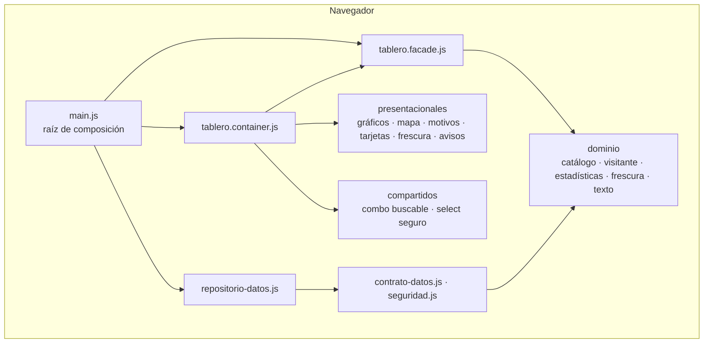
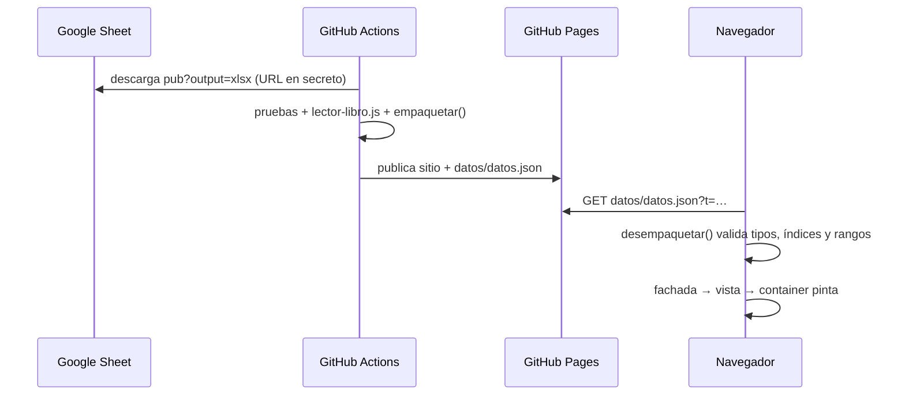

# Arquitectura

## Visión general

Sitio estático sin framework ni paso de build, organizado en **capas semihexagonales**: reglas del negocio
puras en el centro, detalles técnicos alrededor y la interfaz separada en fachada, container y
presentacionales.

## Capas

| Capa | Archivos | Qué hace | Qué no hace |
|---|---|---|---|
| **Dominio** | `src/domain/catalogo.js`, `visitante.js`, `estadisticas.js`, `frescura.js`, `texto.js` | Normaliza filas, reconoce encabezados, calcula KPI y series, clasifica la frescura de la publicación y limpia texto | No conoce el DOM, la red ni las librerías |
| **Infraestructura** | `src/infrastructure/config.js`, `seguridad.js`, `contrato-datos.js`, `repositorio-datos.js`, `lector-libro.js` | Configuración, descarga acotada, formato de `datos.json`, lectura del Excel (en Actions) | No tiene reglas de negocio |
| **Fachada** | `src/application/tablero.facade.js` | Estado de datos y filtros, pestaña del mapa, política de actualización, frescura, vista calculada (incluidos los textos que dependen del periodo) y suscripción a eventos | No toca el DOM; recibe la descarga, el reloj y la visibilidad inyectados |
| **Container** | `src/application/components/tablero.container.js` | Traduce eventos del DOM y de los gráficos en acciones de la fachada y pinta su vista | No calcula ni descarga |
| **Presentacionales** | `src/application/components/presentational/*.js` | Dibujan gráficos, mapa por pestañas, motivos con íconos, tarjetas (con variación y cifras animadas), chip de frescura, chips de filtros y avisos | No guardan estado ni acceden a datos |
| **Compartidos** | `src/application/components/compartidos/*.js` | Combo con búsqueda accesible, llenado seguro de `<select>` y panel de filtros deslizable para celular y tableta | — |
| **Shared** | `src/shared/textos.es.js`, `formato.js`, `tema.js`, `tema-inicial.js` | Textos visibles, formato de números y fechas, y lógica del tema. `tema-inicial.js` es un script clásico que se ejecuta antes del primer pintado (ver [ADR 005](decisiones/005-tema-y-excepciones-de-color.md)) | — |
| **Raíz** | `src/main.js` | Une la infraestructura con la fachada y monta el container | — |

La regla de dependencias está en [`CONTRIBUTING.md`](../CONTRIBUTING.md#3-arquitectura-la-regla-de-dependencias-no-se-rompe),
y la hace cumplir [`test/arquitectura.test.mjs`](../test/arquitectura.test.mjs).

## Flujo de datos

1. **Lectura en Actions:** [`tools/construir-datos.mjs`](../tools/construir-datos.mjs) lee la hoja con
   [`lector-libro.js`](../src/infrastructure/lector-libro.js). Cada pestaña no reservada es un establecimiento.
   Las filas se normalizan contra `_Catalogos`, y las inválidas quedan como rechazos con su pestaña y su fila.
2. **Empaquetado:** [`contrato-datos.js`](../src/infrastructure/contrato-datos.js) empaqueta las filas como
   índices a diccionarios. Pesan unos 0,8 MB para 30.000 filas.
3. **Validación en el navegador:** el navegador valida el paquete antes de usarlo. Un archivo alterado se
   rechaza entero.

## Ciclo de actualización

Lo implementa [`tablero.facade.js`](../src/application/tablero.facade.js):

| Disparador | Regla |
|---|---|
| Entrada a la página y botón «Actualizar» | Descarga forzada |
| Cambio de establecimiento | Descarga solo si pasaron 60 s o más desde la última |
| Automático | Cada 5 min, solo con la pestaña visible; se revisa cada 30 s (con la misma revisión se repinta el chip de frescura) |
| Descarga en curso | No se lanza otra en paralelo |
| Error | Se conservan los últimos datos buenos y se muestra el aviso con la hora de esos datos |

## Pruebas por capa

| Carpeta | Qué cubre |
|---|---|
| `test/domain/` | Conciliación exacta con el oráculo en Python en 7 escenarios |
| `test/infrastructure/` | Lector del libro, contrato de datos, seguridad y descarga acotada |
| `test/application/` | Fachada con reloj y descarga simulados, pestañas del mapa, textos del periodo y opciones de los gráficos |
| `test/shared/` | Formato, textos que dependen de los filtros y tema (incluido el script inicial, ejecutado en un contexto aislado) |
| `test/tema-tokens.test.mjs` | Todo token de color usado existe |
| `test/arquitectura.test.mjs` | Regla de dependencias |
