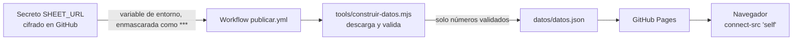

# Configuración: qué, dónde y cómo se cambia

## Mapa de la configuración

| Qué | Dónde | Quién lo cambia |
|---|---|---|
| URL de la hoja (secreta) | GitHub → **Settings → Secrets and variables → Actions → `SHEET_URL`** | Administrador del repositorio |
| Publicación del sitio | GitHub → **Settings → Pages → Source: GitHub Actions** | Administrador del repositorio |
| Frecuencia de publicación | [`.github/workflows/publicar.yml`](../.github/workflows/publicar.yml), `cron: '*/5 * * * *'` | Desarrollo |
| Intervalos, límites y franja de prueba | [`src/infrastructure/config.js`](../src/infrastructure/config.js) | Desarrollo |
| Textos visibles | [`src/shared/textos.es.js`](../src/shared/textos.es.js) | Desarrollo |
| Colores del tema | [`css/tema.css`](../css/tema.css), variables `--verde`, `--lima`, `--amarillo`… | Desarrollo |
| Política de seguridad (CSP) | `<meta http-equiv="Content-Security-Policy">` en [`index.html`](../index.html) | Desarrollo |
| Permisos de la hoja | Google Sheets → **Compartir** y **Datos → Proteger hojas** | Administrador de la hoja |
| Catálogos y coordenadas | Pestaña `_Catalogos` de la hoja | Administrador de la hoja |

## Cómo se oculta la URL de la hoja

La URL publicada de la hoja (`…/pub?output=xlsx`) funciona como una contraseña de lectura: quien la tenga puede
descargar el libro completo. Por eso **no aparece en ningún archivo del repositorio ni del sitio**.

1. **Guardado cifrado.** GitHub guarda el secreto cifrado. Desde la web no se puede leer, ni siquiera por el
   dueño: solo se puede reemplazar.
2. **Uso exclusivo del workflow.** Solo lo recibe el paso «Construir datos desde la hoja» del workflow, como
   variable de entorno. Si llegara a imprimirse en los registros, GitHub lo reemplaza por `***`.
3. **Validación del formato.** [`tools/construir-datos.mjs`](../tools/construir-datos.mjs) comprueba que tenga
   el formato esperado (`https://docs.google.com/spreadsheets/d/e/…/pub?output=xlsx`), descarga el libro con
   límites de tiempo y tamaño y escribe **solo** `datos/datos.json`, con filas ya validadas y sin la URL.
4. **Se publica solo lo público.** El sitio se arma copiando únicamente `index.html`, `css/`, `src/` y los
   recursos públicos. `tools/`, `test/` y el Excel de prueba nunca se publican.
5. **El navegador nunca contacta Google.** La CSP del sitio (`connect-src 'self'`) le prohíbe pedir datos a
   cualquier otro origen.
6. **Una prueba lo vigila.** `test/infrastructure/contrato-datos.test.mjs` falla si la URL o el dominio de
   Google aparecen en `datos.json`.

### Reemplazar el secreto

1. **Settings → Secrets and variables → Actions**.
2. En `SHEET_URL`, pulsa el lápiz (**Update**), pega la URL nueva y guarda.
3. **Actions → Publicar dashboard → Run workflow** para publicar de inmediato.

### Rotar la URL

Hay que hacerlo si la URL se filtró o si cambió la hoja:

1. En Google Sheets: **Archivo → Compartir → Publicar en la web → Detener publicación**.
2. Vuelve a publicar: **Todo el documento**, formato **Microsoft Excel (.xlsx)** y **Volver a publicar
   automáticamente** activado. Google genera una URL nueva y la anterior deja de funcionar.
3. Reemplaza el secreto `SHEET_URL` con la URL nueva, como se explica arriba.

## Parámetros de `src/infrastructure/config.js`

| Clave | Valor | Efecto |
|---|---|---|
| `URL_DATOS` | `'datos/datos.json'` | Archivo que lee el navegador, siempre del mismo sitio |
| `INTERVALO_AUTO_MS` | 5 min | Actualización automática con la pestaña visible |
| `REUSO_MINIMO_MS` | 60 s | Al cambiar de establecimiento, reusa la descarga si es más reciente |
| `TIMEOUT_MS` / `MAX_BYTES` | 15 s / 20 MB | Límites de la descarga |
| `MAX_PESTANAS` / `MAX_FILAS_PESTANA` | 300 / 5000 | Límites de lectura de la hoja |
| `PESTANA_CATALOGOS` | `'_Catalogos'` | Pestaña de listas y coordenadas |
| `DATOS_DE_PRUEBA` | `true` | Muestra la franja «DATOS DE PRUEBA» |
| `PAIS_LOCAL` | `'Ecuador'` | País que define a un visitante nacional |
| `PROVINCIA_RESALTADA` | `'Tungurahua'` | Provincia con borde destacado en el mapa |

## Frecuencia de publicación

El workflow corre en cada `push` a `main`, cada 5 minutos (`schedule`) y a mano (**Run workflow**).

- **Para bajar la frecuencia:** cambia el `cron`. Por ejemplo, `'*/15 * * * *'` publica cada 15 minutos.
- **Para pausarlo:** **Actions → Publicar dashboard → … → Disable workflow**.
