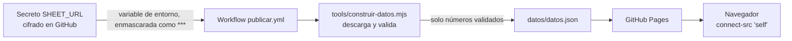

# Configuración: qué, dónde y cómo se cambia

## Mapa de la configuración

| Qué | Dónde | Quién lo cambia |
|---|---|---|
| URL de la hoja (secreta) | GitHub → **Settings → Secrets and variables → Actions → `SHEET_URL`** | Administrador del repositorio |
| Publicación del sitio | GitHub → **Settings → Pages → Source: GitHub Actions** | Administrador del repositorio |
| Frecuencia de publicación | Tarea de cron-job.org (cada 30 min) y [`.github/workflows/publicar.yml`](../.github/workflows/publicar.yml) (`schedule: '15,45 * * * *'`) | Desarrollo y operación |
| Intervalos, umbrales, límites, franja de prueba y contacto | [`src/infrastructure/config.js`](../src/infrastructure/config.js) | Desarrollo |
| Textos visibles | [`src/shared/textos.es.js`](../src/shared/textos.es.js) | Desarrollo |
| Colores del tema | [`css/tema.css`](../css/tema.css), variables `--verde`, `--lima`, `--amarillo`… | Desarrollo |
| Política de seguridad (CSP) | `<meta http-equiv="Content-Security-Policy">` en [`index.html`](../index.html) | Desarrollo |
| Permisos de la hoja | Google Sheets → **Compartir** y **Datos → Proteger hojas** | Administrador de la hoja |
| Catálogos y coordenadas | Pestaña `_Catalogos` de la hoja | Administrador de la hoja |

## Cómo se oculta la URL de la hoja

La URL publicada de la hoja (`…/pub?output=xlsx`) funciona como una contraseña de lectura: quien la tenga puede
descargar el libro completo. Por eso **no aparece en ningún archivo del repositorio ni del sitio**.

```mermaid
flowchart LR
    S[Secreto SHEET_URL<br/>cifrado en GitHub] -->|variable de entorno, enmascarada como ***| W[Workflow publicar.yml]
    W --> T[tools/construir-datos.mjs<br/>descarga y valida]
    T -->|solo números validados| J[datos/datos.json]
    J --> P[GitHub Pages]
    P --> N[Navegador<br/>connect-src 'self']
```

1. **Guardado cifrado.** GitHub guarda el secreto cifrado. Desde la web no se puede leer, ni siquiera por el
   dueño: solo se puede reemplazar.
2. **Uso exclusivo del workflow.** Solo lo recibe el paso «Construir datos desde la hoja» del workflow, como
   variable de entorno. Si llegara a imprimirse en los registros, GitHub lo reemplaza por `***`.
3. **Validación del formato.** [`tools/construir-datos.mjs`](../tools/construir-datos.mjs) comprueba que tenga
   el formato esperado (`https://docs.google.com/spreadsheets/d/e/…/pub?output=xlsx`), descarga el libro con
   límites de tiempo y tamaño y escribe **solo** `datos/datos.json`, con filas ya validadas y sin la URL.
4. **Se publica solo lo público.** El sitio se arma copiando únicamente `index.html`, `css/`, `src/` y los
   recursos públicos (`logo-patate.png`, `fondo-cabecera.jpg`, `ecu-provincias.geojson`, `og.jpg`). `tools/`, `test/` y el Excel de prueba nunca se publican.
5. **El navegador nunca contacta Google.** La CSP del sitio (`connect-src 'self'`) le prohíbe pedir datos a
   cualquier otro origen.
6. **Una prueba lo vigila.** `test/infrastructure/contrato-datos.test.mjs` falla si la URL o el dominio de
   Google aparecen en `datos.json`.

### Reemplazar el secreto

1. **Settings → Secrets and variables → Actions**.
2. En `SHEET_URL`, pulsa el lápiz (**Update**), pega la URL nueva y guarda.
3. **Actions → Publicar dashboard → Run workflow** para publicar de inmediato.

### Rotar la URL

Hay que hacerlo si la URL se filtró o si cambió la hoja:

1. En Google Sheets: **Archivo → Compartir → Publicar en la web → Detener publicación**.
2. Vuelve a publicar: **Todo el documento**, formato **Microsoft Excel (.xlsx)** y **Volver a publicar
   automáticamente** activado. Google genera una URL nueva y la anterior deja de funcionar.
3. Reemplaza el secreto `SHEET_URL` con la URL nueva, como se explica arriba.

## Parámetros de `src/infrastructure/config.js`

Es la única fuente de estos números: ningún otro módulo los repite. `test/infrastructure/config.test.mjs` comprueba que
la consulta del navegador, los umbrales y el `schedule` encajen con la cadencia.

| Clave | Valor | Para qué sirve |
|---|---|---|
| `URL_DATOS` | `'datos/datos.json'` | Archivo que lee el navegador, siempre del mismo sitio. La URL de la hoja vive solo en el secreto `SHEET_URL` |
| `INTERVALO_AUTO_MS` | 10 min (`10 * 60 * 1000`) | Consulta automática mientras la pestaña está visible. Más seguida que la publicación, para ver pronto cada ciclo nuevo |
| `PUBLICACION_MINUTOS` | `30` | Cada cuántos minutos se vuelve a publicar el sitio (cron-job.org). Lo usan el texto del chip y la documentación |
| `REUSO_MINIMO_MS` | 60 s (`60 * 1000`) | Al cambiar de establecimiento se reusa la descarga si es más reciente que esto |
| `UMBRALES_FRESCURA.alDiaMin` | `45` | Edad máxima, en minutos, de la publicación para el chip «Datos al día»: un ciclo de 30 minutos más la demora de Actions |
| `UMBRALES_FRESCURA.retrasadoMin` | `100` | Edad máxima para «Datos con retraso»: tolera perder un ciclo entero. Más allá, «Publicación detenida» |
| `TIMEOUT_MS` | 15 s (`15 * 1000`) | Tiempo máximo de la descarga de `datos.json` en el navegador |
| `MAX_BYTES` | 20 MB (`20 * 1024 * 1024`) | Tamaño máximo de `datos.json` |
| `MAX_BYTES_HOJA` | 50 MB (`50 * 1024 * 1024`) | Tope de la hoja completa en xlsx durante el build: con más de cien pestañas y fórmulas pesa más que el `datos.json` publicado |
| `TIMEOUT_HOJA_MS` | 120 s (`120 * 1000`) | Tiempo máximo de la descarga de la hoja en el build de Actions |
| `MAX_PESTANAS` | `300` | Máximo de pestañas que se leen; el resto se omite con un aviso |
| `MAX_FILAS_PESTANA` | `5000` | Máximo de filas que se leen por pestaña; el resto se omite con un aviso |
| `PESTANA_CATALOGOS` | `'_Catalogos'` | Pestaña con listas y coordenadas. Toda pestaña que empieza por `_` o contiene «plantilla» no es establecimiento |
| `DATOS_DE_PRUEBA` | `false` | Muestra la franja «DATOS DE PRUEBA». Apagada desde que la hoja trae los datos reales del municipio |
| `CONTACTO_MUNICIPIO.nombre` | `'Lic. Vanessa Lesano'` | Nombre del contacto del municipio en el pie |
| `CONTACTO_MUNICIPIO.enlaces.facebook` | `https://www.facebook.com/vane.lesano.martinez` | Enlace de Facebook |
| `CONTACTO_MUNICIPIO.enlaces.tiktok` | `https://www.tiktok.com/@vanelesano` | Enlace de TikTok |
| `CONTACTO_MUNICIPIO.enlaces.linkedin` | `''` (vacío) | Enlace de LinkedIn. Vacío: el botón muestra «Pronto» y abre un aviso con los demás enlaces |
| `PAIS_LOCAL` | `'Ecuador'` | País que define a un visitante como nacional |
| `PROVINCIA_RESALTADA` | `'Tungurahua'` | Provincia que el mapa resalta siempre |

### Reglas de los enlaces de `CONTACTO_MUNICIPIO`

Los valida [`contacto.presentational.js`](../src/application/components/presentational/contacto.presentational.js). Solo se aceptan direcciones
`https://` sin parámetros ni fragmentos (nada después de `?` o `#`). Las redes se muestran siempre en el orden Facebook, TikTok, LinkedIn.

| Red | Forma aceptada |
|---|---|
| Facebook | `https://facebook.com/…`, `https://www.facebook.com/…` o `https://m.facebook.com/…` |
| TikTok | `https://tiktok.com/@usuario` o `https://www.tiktok.com/@usuario` |
| LinkedIn | `https://linkedin.com/in/usuario` o `https://www.linkedin.com/in/usuario` |

Un valor vacío se muestra como botón «Pronto». Un valor que no cumple la forma se oculta.

## Disparadores de la publicación

El flujo [`publicar.yml`](../.github/workflows/publicar.yml) se arranca de tres maneras. Las horas son de cada hora, sin importar la zona horaria.

| Disparador | Cuándo | Qué hace |
|---|---|---|
| **cron-job.org** (una sola tarea) | Cada 30 minutos, en punto y a la media (:00 y :30), vía `workflow_dispatch` con un token de permiso mínimo. Es el principal | Construye los datos y despliega, sin correr las pruebas |
| `schedule` de GitHub `'15,45 * * * *'` | :15 y :45, todo el día. Refuerzo propio | Igual que cron-job.org. GitHub puede retrasarlo bajo carga |
| `push` a `main` | Cada cambio de código | Corre las pruebas (`node --test "test/**/*.test.mjs"`), construye y despliega |

Además, el job `destrabar` corre al inicio de cada ejecución, sin importar quién la disparó (ver [observabilidad.md](observabilidad.md#el-job-destrabar)).

La cifra de 30 minutos vive en `PUBLICACION_MINUTOS`. El `schedule` del YAML y la tarea de cron-job.org no pueden leer esa constante y se cambian a mano.

- **Para cambiar la frecuencia:** edita la tarea en cron-job.org, el `schedule` de `publicar.yml` y `PUBLICACION_MINUTOS`; ajusta también `UMBRALES_FRESCURA` si cambia el ciclo.
- **Para pausarlo:** **Actions → Publicar dashboard → … → Disable workflow** y pausa la tarea en cron-job.org. Pausar el flujo a mano detiene también el mantenimiento que hace `destrabar`; si queda pausado más de 60 días, GitHub lo desactiva y hay que reactivarlo con «Enable workflow».
